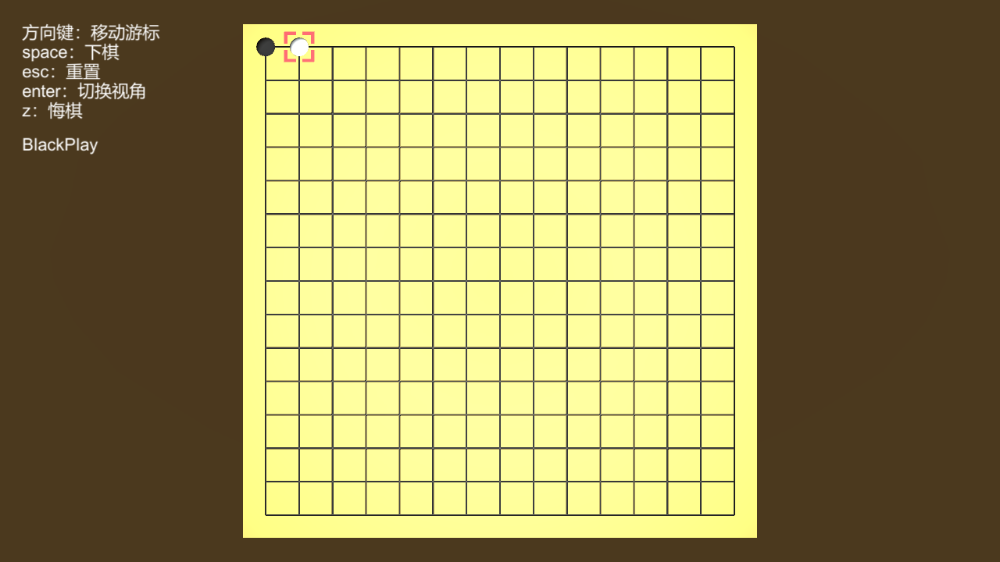
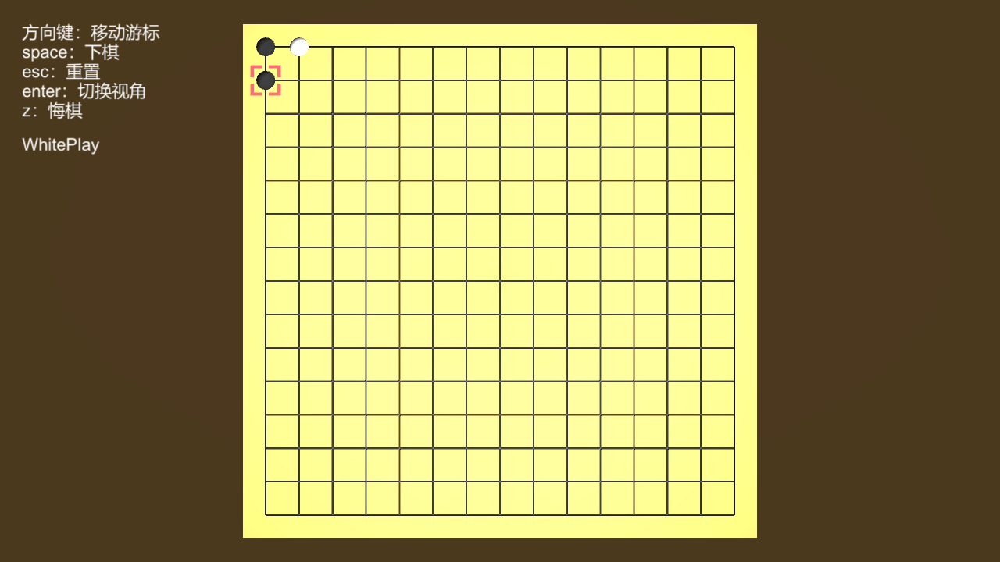

- Input: A json containing the current game data  
for example
```json
{
    "gameTrace": 
    [
        {
            "order" : 0,
            "player" : "black",
            "x" : 0,
            "y" : 14
        },
        {
            "order" : 1,
            "player" : "white",
            "x" : 1,
            "y" : 14
        }
    ]
}
```
stands for the following game status  
  

- Output: A json containing the data which describes **one step** performed by AI  
for example
```json
{
    "order" : 2,
    "player" : "black",
    "x" : 0,
    "y" : 13   
}
```
then the game would be  
  

- Requirements  
    - The AI module written by native c++ should read a json and write a json.  
        The function **MUST match the types** in the following signature.
        ```c++
            void drive_ai(const char *json_in, char *json_out, int out_capacity);
            // write no more than out_capacity characters into json_out
            // out_capacity is provided by external c# code and will be 100
        ```
    - (To be done by me) The c++ module will be compiled to DLL, loaded in unity and called by the managed c# script.
    - All the coordinates and indexes **should start at 0 NOT 1**.